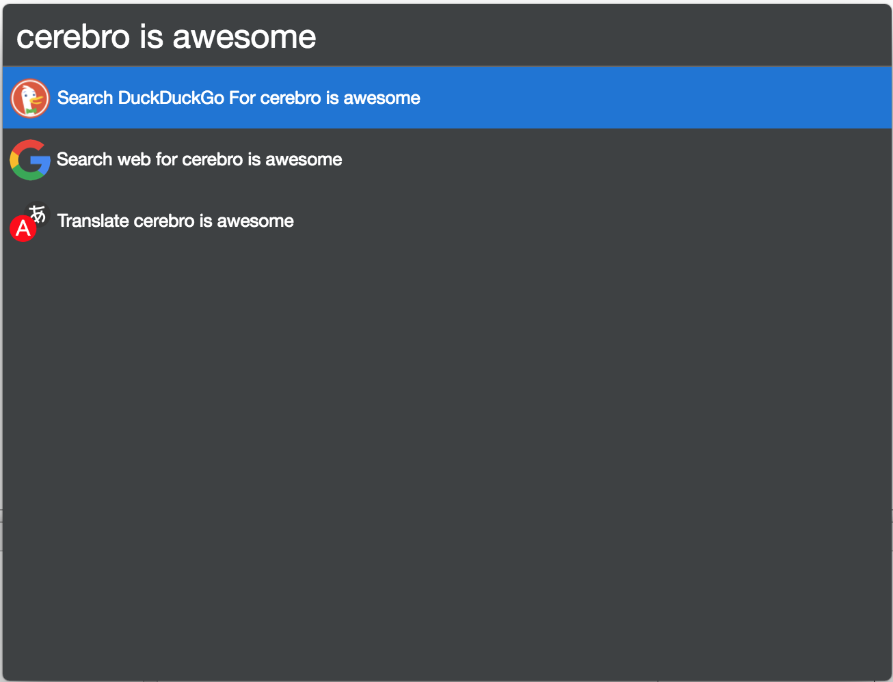

# cerebro-duck-duck-go

> [Cerebro](https://cerebroapp.com) plugin to use DuckDuckGo as a search engine

## Usage

In Cerebro, type any term, and the DuckDuckGo plugin will show some suggestions:

## Roadmap

- [x] Preview Results as [Cerebro's native Google Plugin](https://github.com/KELiON/cerebro/blob/master/app/main/plugins/core/google/index.js)
    - Solved at https://github.com/tiagoamaro/cerebro-duck-duck-go/pull/1. Thanks @KELiON!

## License

MIT © [Tiago Amaro](http://tiagoamaro.com.br)
